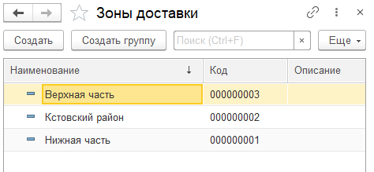

# Зоны доставки

Справочник **"Зоны доставки"** предназначен для хранения информации о зонах доставки, которые могут быть сгруппированы по территориальным признакам: регионам, районам, участкам и т.д.

Информация о зонах доставки используется в рабочем месте менеджера по доставке для составления оптимальных маршрутов транспортных средств.
