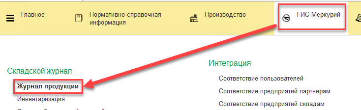
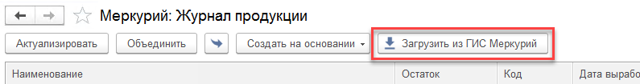
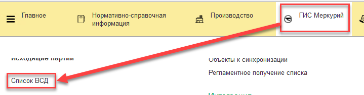
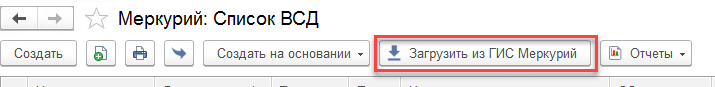
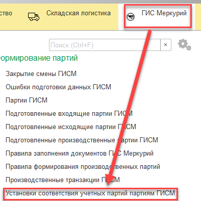
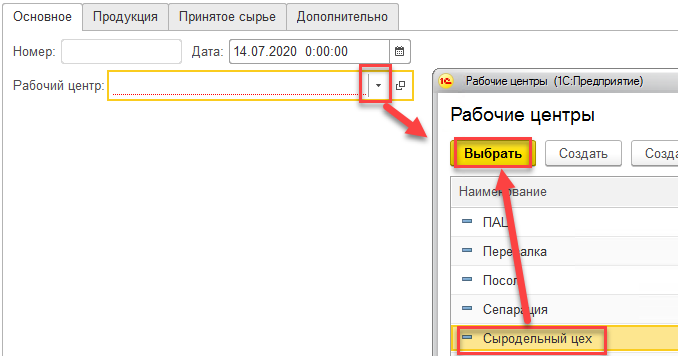
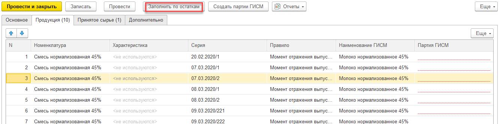
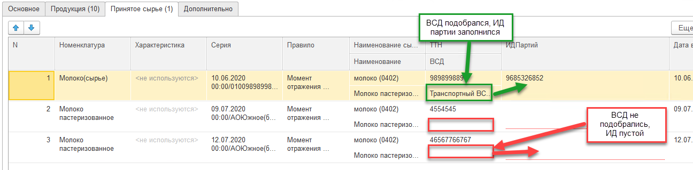
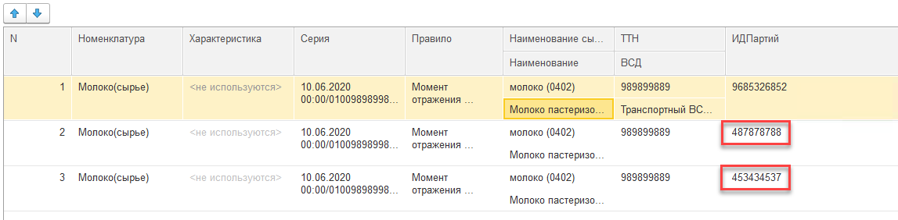

# Начало работы. Установка соответствий учетных партий партиям Меркурия

??? Info "Если учетная система MES была запущена без использования модуля Меркурия, и в то же время обмен с Меркурием совершался вручную (не через 1С), то перед стартом использования нового модуля Меркурий нужно установить соответствие остатков партий учетных остаткам журнала продукции Меркурия"

- Для начала после всех настроек и [установки правил для номенклатур](SettingRulesForInterpretation.md) необходимо подгрузить "Журнал продукции" из Меркурия в систему:

- Загрузить все ВСД вручную:

- Или регламентным получением списка, как описано в разделе "[Подгрузка ВСД](MilkReceiving/LoadDocs.md)"

- Настроить [шаблоны наименований для продукции](RegulatoryInformation/TemplatesOfID/TemplatesOfID.md).

- После того, как эти все данные загружены в систему, открыть документы "Установки соответствия учетных партий партиям ГИСМ"

- Перейти к созданию нового.
- Выбрать Рабочий центр. По его складам будут подобраны остатки, для которых **настроено правило интерпретации** и для которых **нет соответствия** партиям журнала продукции:

- Нажать "Заполнить по остаткам". Остатки разносятся на две вкладки: продукция (партии которых передаются в Меркурий при закрытии смены или при отгрузке) и принятое сырье (партии которых передаются только при приемке). Для продукции делать так:

- При необходимости, удалить строки остатков, для которых не нужно формировать остатки в журнале продукции (возможно, подтянулись какие-то остатки усушки, которые еще не успели списать). 
- В случае заполнения информации по принятому сырью, если по партиям найдутся ВСД (в соответствие с номером ТТН из документа Поступления), ИД партий также заполнятся.  Однако, если ВСД не найдутся, нужно будет вручную указать ИД партий из ВСД, с которыми партии были приняты:

т.е. в данном примере для партии второй строки `Молоко(сырье)` в ВСД, сопровождавшем данную партию, ИД партии была строка `487878788`.

- Нажать "Создать партии ГИСМ". Напротив каждой строки заполнится поле "Партия ГИСМ" по правилам, указанным в настройках номенклатуры.
- Нажать "Провести и закрыть".