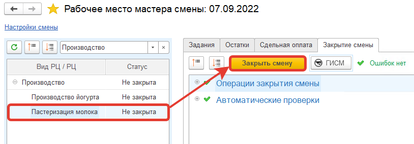
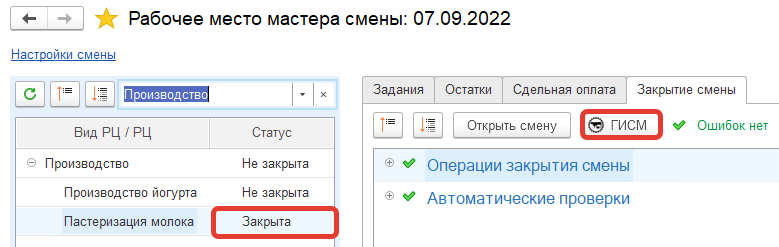
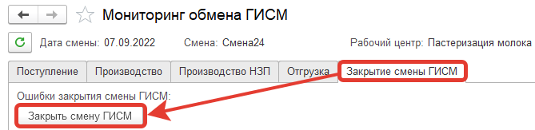
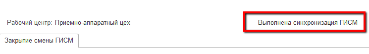
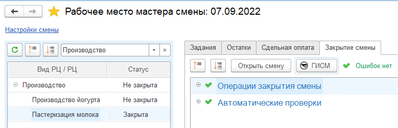

# Закрытие смены на участке приемки

После того, как все данные отправлены, все корректно сделано, смену на участке приемки необходимо закрыть.

- Сначала закрывается смена в учетном контуре:

- После успешности закрытия, ее также нужно закрыть в контуре Меркурия:

- При успешном закрытии по Меркурию список ошибок будет пустым, а статус в мониторинге сменится на "Выполнена синхронизация с ГИСМ":

- В Рабочем месте мастера смены появится соответствующий значок:

