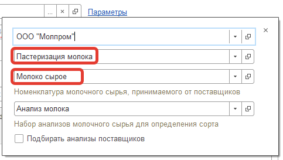
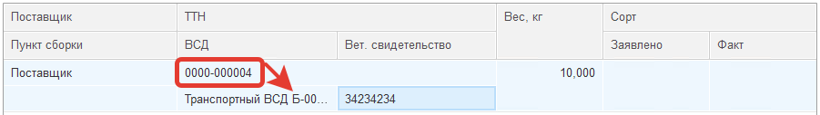
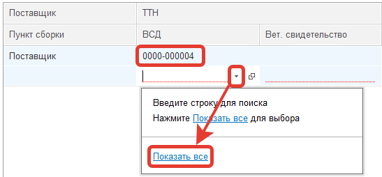
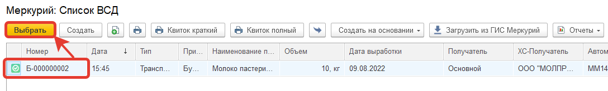

# Приемка молочного сырья

Процесс приемки мало чем будет отличаться от стандартных действий. Однако, важно не забывать, какое сырье принимается в данный момент, особенно, если существуют две параллельные схемы - со списанием в месячную транзакцию и без.

- Указать что принимаем, на какой участок:

- Как и прежде, указать данные смены, машины, указать поставщика.
- В поле "ТТН" указать номер ТТН. Если все введено правильно (номер машины, ТТН, выбрано правильное сырье), а ВСД подгружены, то автоматически заполнится поле ВСД, поле Вет.свидетельства и поле заявленного веса:

- Может быть ситуация, что по одной ТТН принимается несколько партий сырья, в таком случае нужно вручную выбрать нужный ВСД:

- Все остальное делается прежней схемой.

Указание, сколько сырья в какие танки пошло, происходит в прежнем формате.
