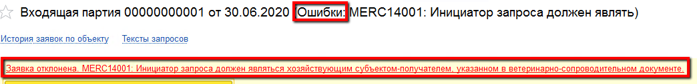

# Отправка данных и гашение ВСД

Если в системе настроено регламентное задание, то спустя какое-то время после приемки, если не возникнет ошибок, в контуре Меркурия появятся остатки, а ВСД будут погашены.

Все это можно отследить, а в случае выключенного задания - сделать руками через Рабочее место мастера смены.

- Открыть "Рабочее место мастера смены":

- Указать дату смены и смену.
- Выбрать участок, на который принималось молоко:

- Нажать кнопку "ГИСМ".  Откроется форма мониторинга обмена данных с Меркурием. Сразу открывается вкладка поступлений, где видны только те, которые были приняты в указанную смену на склады выбранного рабочего центра:

- В случае, когда рег.задание на отправку данных включено, здесь уже можно видеть результаты его работы. Самая левая колонка с иконками отражает успешность обмена данными по разным документам:

- Также можно делать отборы по этим статусам, чтобы видеть только нужные:

- В случае отключенного рег.задания по кнопке "Подготовить партии" можно сделать подготовку и отправку данных. Достаточно несколько раз нажать на нее с определенной паузой (чтобы обмен мог успеть состояться). Обычно хватает 3-4 нажатий (зависит от наличия списания в НЗП), справа видны изменения, которые происходят при этих нажатиях:

- При возникновении красных иконок не стоит пугаться. Бывает так, что данные еще не успели отправиться, а система уже пытается сделать следующее действие. В этом случае можно открыть ошибочную партию справа (двойным щелчком по столбцу "Объект ГИСМ") и проверить статус заявки:

- Если статус "Отправляется", то подождать еще:

- Если статус ошибки, то рядом с ним будем написана причина. С ней лучше обращаться к системному администратору:

- Если статус "Синхронизировано", закрыть заявку и еще раз нажать "Подготовить партии" (в случае, если до сих пор горит красный крестик):

- Если даже после этого крестик не ушел, то возможные ошибки можно посмотреть, нажав на конкретный документ с ошибкой:

**Возможные ошибки и как их исправить:**

1. Ошибка подбора журналов. Недостаточно остатков продукции.   
    Могло произойти так, что какими-то неправильными данными приняли просроченное молоко. Контур Меркурия не смотрит в отрицательные остатки, т.к. считает, что их нельзя перерабатывать ни при каких условиях.  
    Проверить сроки годности в ВСД. Если они действительно устарели - обратиться с вопросом к хозяйству-отправителю.

2. Та же ошибка, однако сроки годности верные.  
    Могло произойти так, что ВСД был прислан без идентификатора партии. Тут тоже возникает вопрос к хозяйству-отправителю.  
    Если ВСД будет исправлен, то старые документы (подготовки партий в Меркурии) удалить, перепровести документы поступления сырья.

3. Ошибка при выпуске первичной обработки. Входящие партии не обработаны ГИСМ  
    Возникает, если были первые варианты ошибок. Система пыталась дальше обработать данные, но безуспешно.

4. Данные для отправки в ГИСМ уже подготовлены документом.  
    Возникает при изменении количества принятого сырья. Так делать нельзя после того, как данные отправлены в контур Меркурия. Тем более на основании того же ВСД, который погашен.
