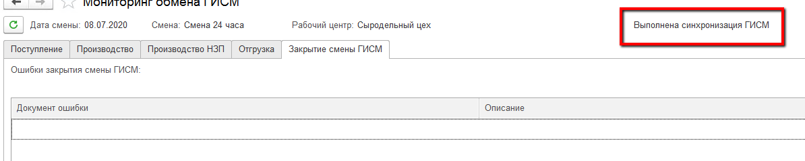

# Выпуск продукции и отправка данных при закрытии смен

??? Info "Важно.  Закрытие смены означает, что все цифры выпусков и сырья проверены, а значит, данные могут быть отправлены в Меркурий"

??? Info "Данные по производственным участкам, отправленные в Меркурий, не могут быть легко исправлены, т.к. реальный контур Меркурия не является частью учетной системы, а те данные, что есть в системе - лишь связующий слой между этими Меркурием и производством"

- Когда все данные проверены, смена на участке закрывается, как и всегда по кнопке "Закрыть":

- В случае, если не было ошибок и статус смены меняется на "Закрыта" или "Закрыта с отклонениями", по всей подконтрольной продукции, выпущенной на закрываемом участке создаются документы подготовки партий, ожидающие отправки в Меркурий. Перейти в мониторинг обмена:

- На вкладке "Производство" как раз те партии, которые готовы к отправке.  Напротив каждой из них в самом левом столбце есть картинка, которая отвечает за результат обмена:

- Также можно делать отборы по этим статусам, чтобы видеть только нужные:

- Если рег.задание на отправку включено, то возможно, можно увидеть уже готовый результат (в случае если не было ошибок - напротив каждой партии зеленый знак с галочкой):

- Если рег.задание выключено, то видно, что партии просто подготовлены к отправке:

- В таком случае нужно нажать несколько раз (с небольшими паузами, чтобы обмен успел состояться) на кнопку "Подготовить партии". Обычно хватает 3-4 нажатий (зависит от наличия списания в НЗП), справа видны изменения, которые происходят при этих нажатиях:

- При возникновении красных иконок не стоит пугаться. Бывает так, что данные еще не успели отправиться, а система уже пытается сделать следующее действие. В этом случае можно открыть ошибочную партию справа (двойным щелчком по столбцу "Объект ГИСМ") и проверить статус заявки:

- Если статус "Отправляется", то подождать еще:

- Если статус ошибки, то рядом с ним будем написана причина. С ней лучше обращаться к системному администратору:

- Если статус "Синхронизировано", закрыть заявку и еще раз нажать "Подготовить партии" (в случае, если до сих пор горит красный крестик):

- Если даже после этого крестик не ушел, то возможные ошибки можно посмотреть, нажав на ошибочный документ:

**Возможные ошибки и как их исправить:**

1. Ошибка подбора журналов. Недостаточно остатков продукции.   
   Могло произойти так, что не заполнили сроки годности у продукции. И по умолчанию он встал равным текущему дню. Контур Меркурия не смотрит в просроченные остатки (а текущий день - это уже просрочен), т.к. считает, что их нельзя перерабатывать ни при каких условиях.  
   Проверить указание срока годности в справочнике "Наименование продукции". Заполнить, обновить элемент:

   

   Удалить документ подготовки партий с ошибкой.

   Провести инвентаризацию, через которую изменить сроки годности у ошибочных партий продукции:

   

   Изменить сроки годности в справочнике "Партии ГИСМ" у соответствующих элементов:

   

   Еще раз выполнить рег.задание или нажать соответствующую кнопку в мониторинге.

2. Не найдено сырье соответствия ГИСМ.  
   Возникает при изменении количества выпуска без увеличения потраченного на него сырья. Так делать с производственными партиями нельзя после того, как данные отправлены в контур Меркурия. 

- По итогу отправки данных смену по ГИСМ тоже нужно закрыть:

- Если все успешно, то в таблице ошибок не будет ничего, а статус смены обновится на "Выполнена синхронизация с ГИСМ":

