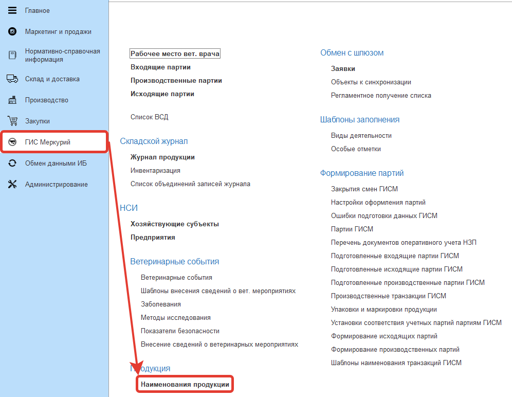
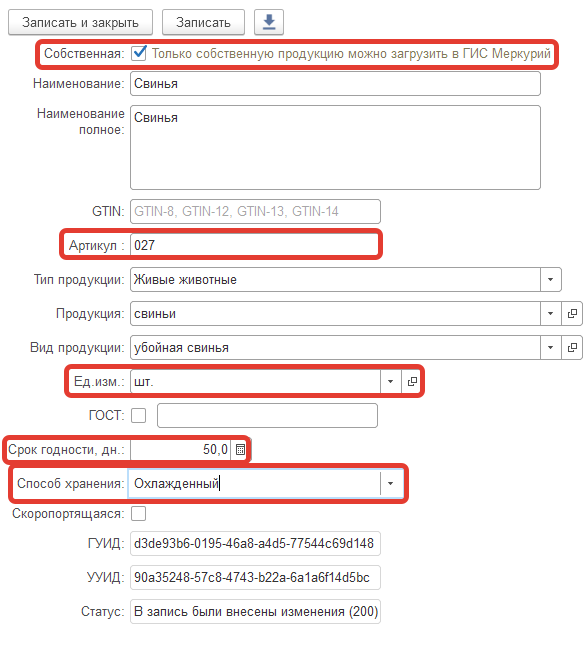
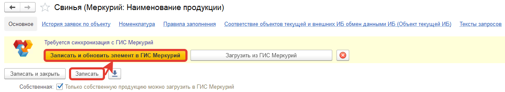

# Изменение загруженной продукции Меркурия

Может случиться так, что данные проще обновить через систему, нежели через Меркурий. Например, указать артикул, срок годности и т.п. данные.

- Открыть справочник "Наименование продукции":

{: width=70%}

- Найти нужную продукцию, открыть её.
- Заполнить необходимые данные. Например, артикул, срок данных, способ перевозки и единицу измерения:

{: width=70%}

- Нажать "Записать". После этого появится кнопка "Записать и обновить элемент в ГИС Меркурий":

- Нажать на эту кнопку. Дождаться успешности обновления (кнопка пропадет). Либо же может вывестись сообщение об ошибке - исправить проблему и отправить повторно.