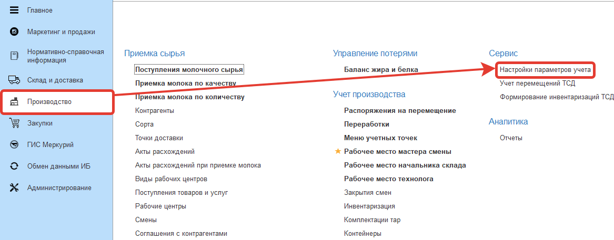
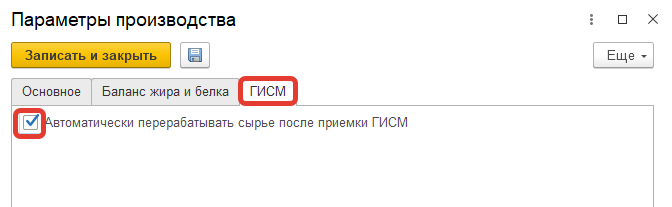

# Настройки констант в системе

## Включение опции первичной обработки сырья

Если требуется на уровне Меркурия делать "фиктивную" первичную обработку сырья (что выпускать не из чистого сырья, а уже из обработанного), при условии, что она не учитывается в производственном контуре, то можно включить эту функцию в системе:

- Открыть "Производство" -> "Настройки параметров учета":

- Перейти на вкладку "ГИСМ" и установить галочку "Автоматически перерабатывать сырье после приемки ГИСМ":

- Нажать "Записать и закрыть".