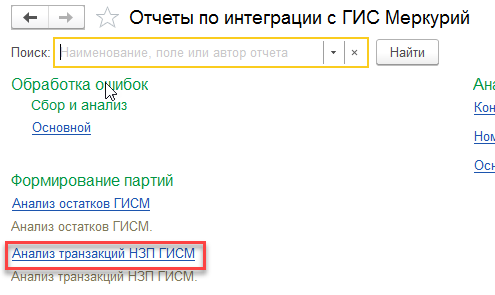

# Отчеты по транзакциям и остаткам продукции

## Отчет по транзакциям

По созданным транзакциям в системе можно смотреть отчеты в формате "Что было в неё списано в качестве сырья, что - в качестве продукции".

Эту информацию можно посмотреть двумя способами.

- Первый - открыть общий отчет по транзакциям:

- При необходимости указать отборы на период, вид транзакций или рабочий центр, по которому хотелось бы посмотреть информацию:

- Сформировать отчет. Транзакции в нем сгруппированы по Рабочему центру и дате:

По каждой транзакции выводится информация о том, что в неё было списано в качестве сырья (подраздел "Сырье"), а что в качестве продукции (подраздел "Продукция").

- А в мониторинге обмена можно посмотреть информацию по конкретно выбранной транзакции. Открыть на одном из участков, где есть транзакции НЗП:

- Перейти в мониторинг обмена:

- Перейти на вкладку "Производство НЗП":

- Выбрать нужную транзакцию и нажать кнопку формирования отчета:

- Сформируется тот же самый отчет, однако, здесь будет представлена информация только по выбранной транзакции.

## Отчет по соответствию остатков учетных партий партиям Меркурия

Расхождения между остатками партий учетных и остатками партий журнала продукции можно посмотреть в отчете "Анализ остатков ГИСМ".

- Открыть отчет:

- Указать ХС и его предприятие:

- Сформировать отчет. По каждой партии ГИСМ будет видна информация о том, какие серии производственного контура ей соответствуют:  
  
  - В столбце "Свободный остаток ГИСМ" отображается остаток из журнала продукции данной партии Меркурия
  - В столбце "Остаток Учет" - отображается остаток серии (или нескольких) производственной, которые соответствуют сгруппировавшей их партии ГИСМ

    Например, по партии "Сыр Сливочный 45%, 4.8 кг сырье / 00000000041_1_260620_240920" видно, что ей соответствуют две производственные серии "Сливочный 45%, Варка, 26.06.2020/1" и "Сливочный 45%, Варка, 26.06.2020/2", остатки по которым 215 и 52 кг соответственно. Однако, остатки журнала продукции этой партии в сумме дают всего 215. Значит, нужно искать причину такой разницы:  
    Измененные цифры в производстве;  
    Резерв остатков журнала продукции;  
    и т.п.
- По полям остатков можно сделать расшифровку, чтобы посмотреть, какими документами были получены производственные остатки, а какими - возможно, зарезервированы остатки Меркурия:

Видим, что учетные остатки сформировались двумя переработками. Но при этом нет никаких резервов. И видим, что по одной из партий Меркурия остаток **163/215 кг**.

Получается, что продукция в контуре Меркурия была на что-то списана, а вот производственный контур остался нетронутым.

## Мониторинг закрытых смен

Посмотреть, какие смены по каким участка были закрыты по контуру Меркурия, можно в уже знакомом отчете "Мониторинг смен".

- Теперь напротив каждой выводится еще информация о том, была ли смена закрыта в контуре Меркурия:

