# Установка правил передачи продукции в Меркурий

## Установка признака подконтрольности продукции

Определить, будет выпускаемая номенклатура подконтрольной или нет, для начала нужно на уровне справочника "Виды номенклатуры". Но опять же, установка данного признака не означает, что вся номенклатура с этим видом будет подконтрольной - функционал гибко настраивается.

- Открыть справочник "Виды номенклатуры":

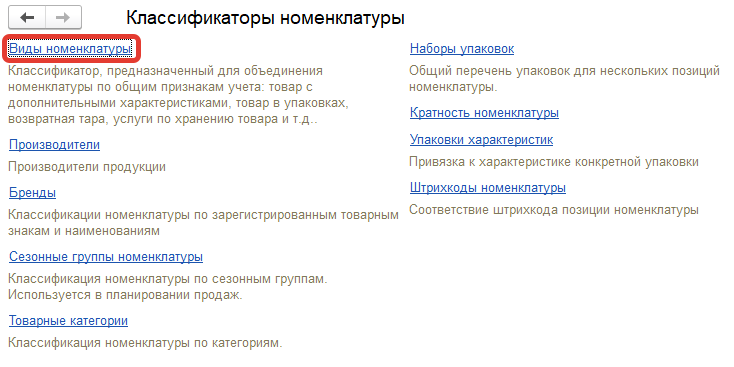

- Открыть очередной элемент справочника, на котором нужно включить контроль:

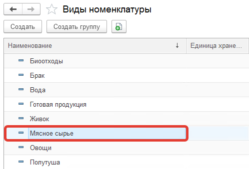

- Установить галочку "Подконтрольная продукция (меркурий)":

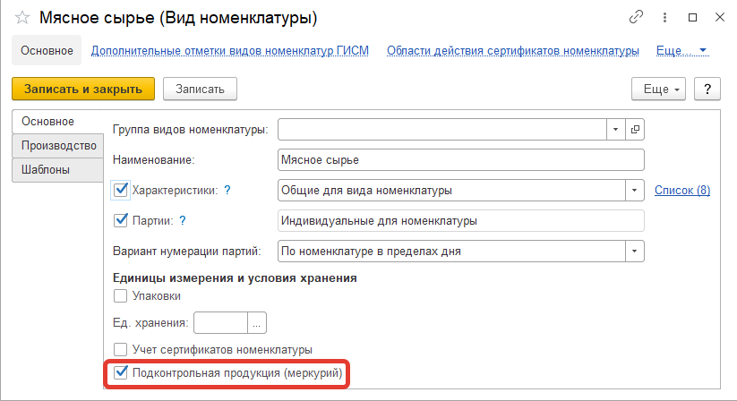

- Нажать "Записать и закрыть".

## Установка особых отметок на уровне вида номенклатуры

Чтобы в документах Меркурия (подготовки партий) автоматически заполнялись данные об особых отметках, качестве продукций и прочих значениях, их можно заполнить в виде номенклатуры с возможностью переопределить в конкретных номенклатурах.

- Открыть справочник "Виды номенклатуры":

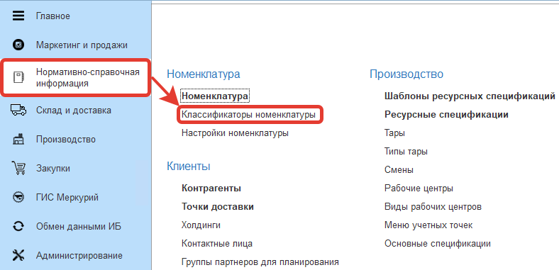

- Открыть очередной элемент справочника, на котором нужно настроить отметки:

- Перейти по ссылке "Дополнительные отметки видов номенклатур ГИСМ":

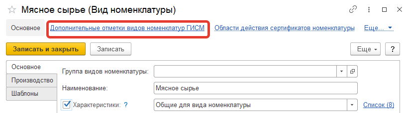

- Нажать "Создать".
- В открывшемся окне заполнить все необходимые данные:

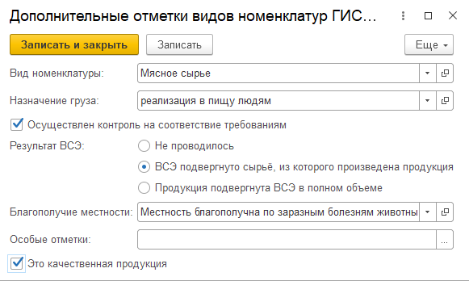

- Нажать "Записать и закрыть".

## Установка правил передачи продукции в Меркурий

Чтобы определить, как данные по тем или иным партиям продукции будут передаваться в контур Меркурия (при закрытии смен, при отгрузке и т.п.), для каждой номенклатуры/характеристики необходимо задать эти правила.

??? Info "Важно. Если какую-либо из номенклатур или характеристик этой номенклатуры, находящейся 'посередине' технологического процесса не нужно отправлять в Меркурий, для нее не делается ничего из нижеописанного"

### Для номенклатур без характеристик

- Открыть справочник "Номенклатура":

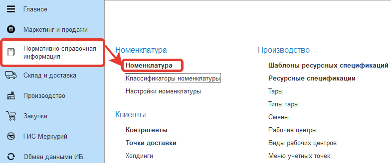

- Открыть очередной элемент справочника, для которого нужно настроить правила:

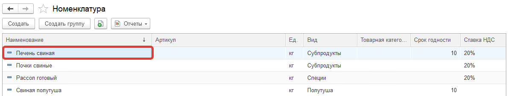

- Перевыбрать его вид номенклатуры на тот же самый (это нужно, чтобы подтянулся признак подконтрольности продукции):

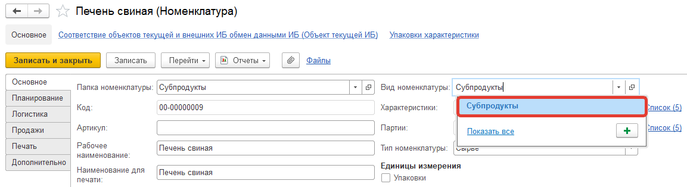

- Нажать "Записать".
- Перейти на вкладку "Дополнительно" и перейти по ссылке "ГИС Меркурий":

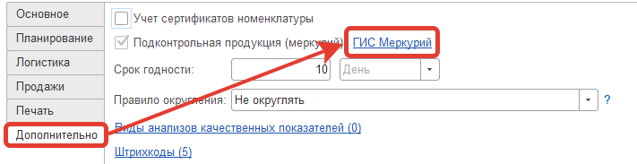

- Откроется форма настройки правил. Для самого первичного сырья здесь будет только одна строка, которая ему и соответствует. Как это выглядит для продукции и полуфабрикатов - в следующем разделе.
- Если не было настроено соответствие продукции, то настроить его, открыв настройку двойным нажатием на соответствующее поле:

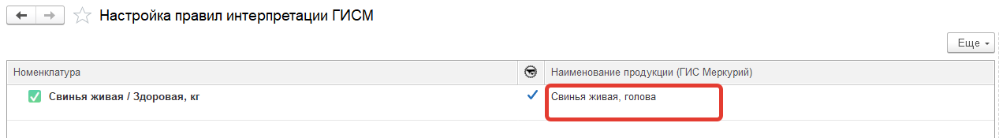

- Настроить соответствие по правилам, описанным в разделе [Настройка соответствия продукции]()
- Теперь нужно настроить само правило, нажав кнопку его редактирования:

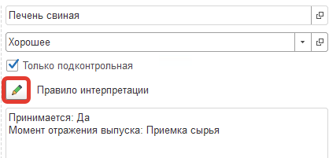

- В открывшейся форме необходимо заполнить все поля в соответствие с данным, описанными в разделе [Параметры правил и их значения](#_7)
- Заполнить особые отметки для номенклатуры. Можно заполнить их данными из вида номенклатуры (как описано в [Установке особых отметок вида номенклатуры](#_3)) или указать отдельно:

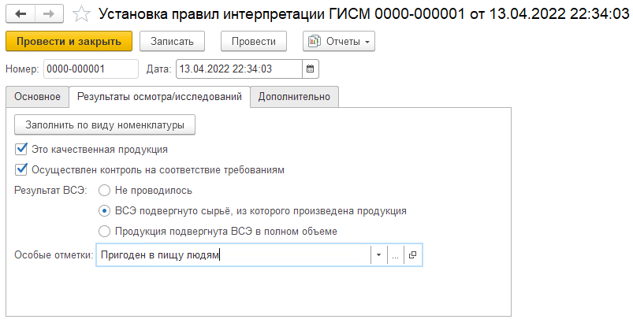

- Нажать "Провести и закрыть".

### Для номенклатур с характеристиками

Для номенклатур с характеристиками нужно настраивать соответствия и правила только для тех характеристик, которые будут передаваться в контур Меркурия.

Пример, как это может выглядеть (напротив того, что будет передаваться, стоят зеленые квадратики):

1. Схема с укрупнением переделов (здесь будет передаваться сыр созревший при отгрузке, а сырьем для него будет отображаться молоко):  
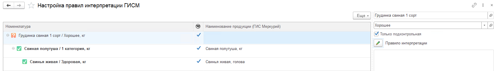  
2. Схема с более детализированными переделами (здесь будет передаваться все, кроме выпуска характеристики "На созревании"):  
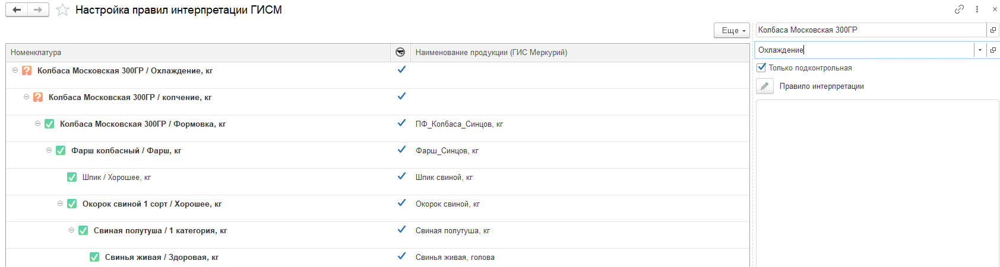

Само указание правил почти ничем не отличается от номенклатуры без характеристик. Единственное, при открытии формы нужно указывать характеристику (совет: лучше указать самую "верхнюю" по основной спецификации, чтобы были видны все остальные):

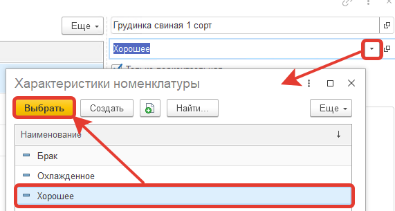

а настройку соответствий и правил нужно делать только для тех характеристик, выпуски которых будут передаваться в Меркурий.

### Параметры правил и их значения

| Имя параметра                                                | Значение                                     | Описание                                                     |
| ------------------------------------------------------------ | -------------------------------------------- | ------------------------------------------------------------ |
| Принимается/Производится/Отгружается                         | Да/Нет                                       | Для случаев, если номенклатура может принимать участие в нескольких операциях. Например, если она производится, потом отгружается - то поставить две соответствующие галки |
| Пересчитывать в единицу измерения веса                       | Да/Нет                                       | Если у номенклатуры основная единица не равна весовой (например, штуки), установленной в настройках системы, то виден этот параметр, по которому при отправке данных будет идти пересчет на вес. отправляться будет также вес |
| Момент отражения выпуска                                     | Приемка сырья                                | Партии и остатки журнала появляются в момент принятия данной номенклатуры документами поступления (через соответствующие АРМы в том числе) |
|                                                              | Закрытие смены                               | Партии и остатки журнала появляются в момент закрытия смены, где была выпущена данная номенклатура |
|                                                              | При отгрузке                                 | Партии и остатки, а также исходящие партии появляются при создании документа отгрузки на данную номенклатуру. Важно! Обязательно в одной из предыдущих смен отгружаемая партия данной номенклатуры/характеристики должна быть выпущена (сырье может распределяться и после отгрузки) |
| Выполнять первичную обработку                                | Да/Нет                                       | Если в системе включена опция первичной обработки сырья, то здесь необходимо установить признак уже в разрезе продукции, будет происходить обработка или нет |
| Выпуск автоматической переработки (виден, если Момент выпуска - Приемка) | Элемент справочника "Наименование продукции" | Если включена опция первичной обработки сырья для данной номенклатуры, то здесь необходимо указать, какая продукция получается после этой обработки |
| Пересчитывать в базисные килограммы (виден, если Момент выпуска - Приемка) | Да/Нет                                       | Принимаемое сырье либо поступает в том же количестве, сколько указано в документе, либо же пересчитывается в базисные килограммы, если у поставщика идет приемка по зачетному весу |
| Вид детализаций партий выпуска                               | По данным учетной системы                    | Партия Меркурия всегда будет соответствовать только одной учетной партии |
|                                                              | День/Неделя/Декада/Месяц                     | Партия Меркурия объединяет в себе учетные партии за день/неделю и т.д. Т.е. происходит укрупнение учетных партий одной номенклатуры/характеристики за указанный период |
| Способ подбора партий сырья                                  | По данным учетной системы                    | Что по данным учетной системы было списано на данную продукцию, то и будет искаться в качестве сырья на данную продукцию |
|                                                              | Из незавершенного производства               | Партии сырья ищутся в незавершенном производстве             |
|                                                              | По данным журнала продукции меркурий         | По данным журнала продукции подбираются партии по ФЕФО       |
| Автоматически списывать в незавершенное производство         | Да/Нет                                       | При включенной галочке, выпуск оформляется как незавершенное производство. |
| Вид производственной транзакции (виден, если включено Автосписание в НЗП) | По данным учетной системы                    | Транзакции создаются на каждую партию учетной системы        |
|                                                              | Месяц                                        | Одна транзакция на месяц                                     |

### Возможные ошибки и способы решения

1. Какой-то полуфабрикат не виден в схеме готовой продукции, хотя подконтроль включен

Например, так (тут должна еще быть Смесь между молоком и сыром):

> Не указана основная спецификация для полуфабриката

