# Отгружаемая продукция. Подготовка партий и ВСД

??? Info "Важное условие успешности создания ВСД - отгружаемые партии продукции должны быть уже выпущены в производственном контуре в текущей или в одной из предыдущей смене"

- Как и прежде создается документ "Распоряжение на отгрузку", в котором обязательно указывается "Задание на доставку" с "Реализацией товаров" :

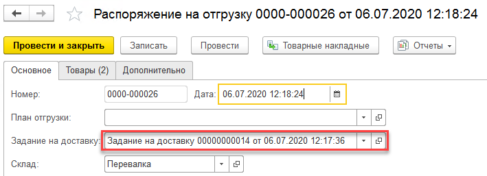

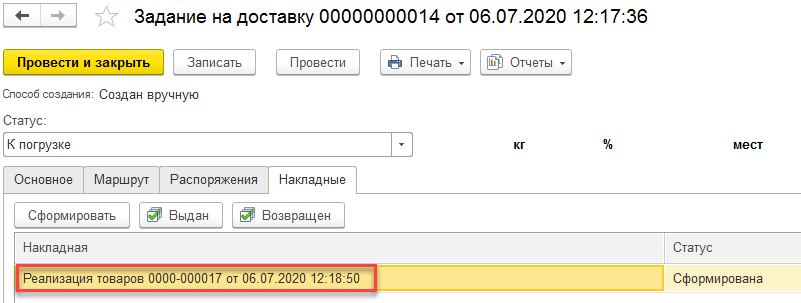

- При проведении документа в системе формируются данные для отправки в Меркурий по отгружаемым партиям:

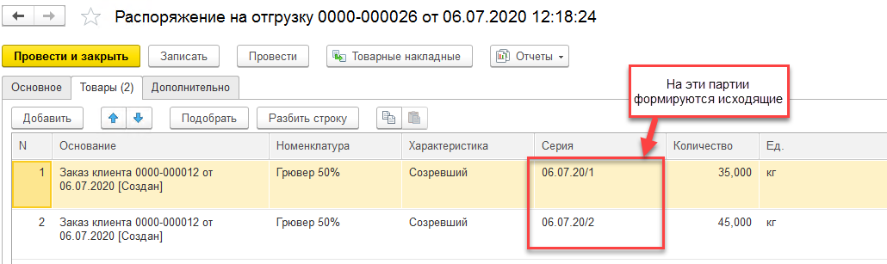

## Автоотправка данных регламентным заданием

- После выполнения рег.задания формируются также и производственные партии, являющиеся основанием исходящих.
- Посмотреть успешность подготовки-отправки этих данных можно также в Закрытии смены. На производственные партии информация будет видна по участку, где они были выпущены, в ту смену, в которую они были выпущены. Например, отгрузка идет 09.07, а выпуск был 08.07. Открыть смену выпуска и перейти в мониторинг отправки данных:

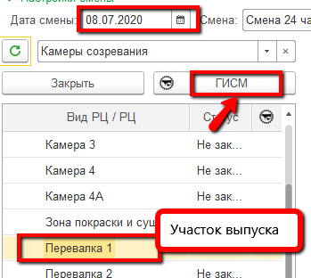

- На вкладке "Производство" отобразятся документы подготовки партий производственных и статусы их создания/отправки:

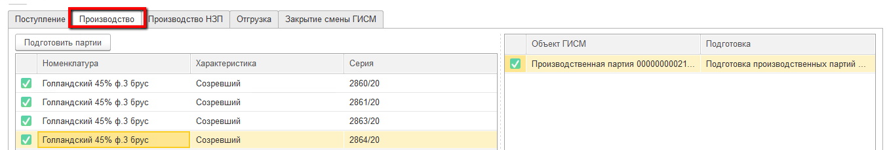

- В случае наличия ошибок простых (забыли установить соответствие продукции, склада и т.п.) просмотреть ошибки, устранить причины и дождаться, когда рег.задание снова подготовит данные. 

  Например, такая ошибка - простая:

  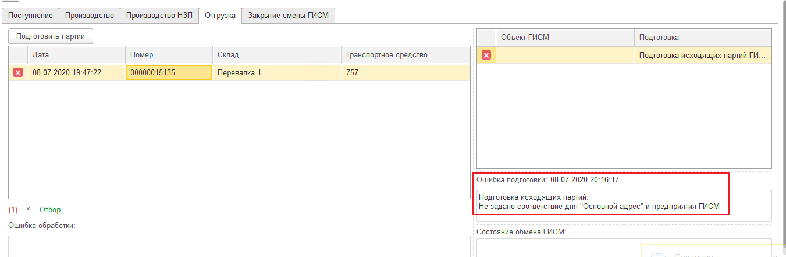

- Если ошибки в самой логике создания документов (неправильно настроили правила интерпретации или неправильно указали материалы) - исправить данные, удалить документы подготовки и дождаться, когда рег.задание снова подготовит данные. 

- Проверить данные уже по самой отгрузке можно на вкладке "Отгрузка". Установить отбор на нужные склады отгрузки:

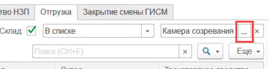

- Если все хорошо, то здесь также уже будут видны готовые документы:

  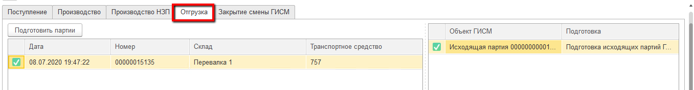

## Ручная подготовка данных

Если рег.задание отключено, то есть возможность подготовить все данные руками.

- Для этого после создания документов отгрузки, открыть Закрытие смены на участке выпуска отгружаемых партий за смену их выпуска и перейти в мониторинг отправки:

- Перейти на вкладку "Производство". В таблице видны партии, подготовленные к списанию на отгрузку:

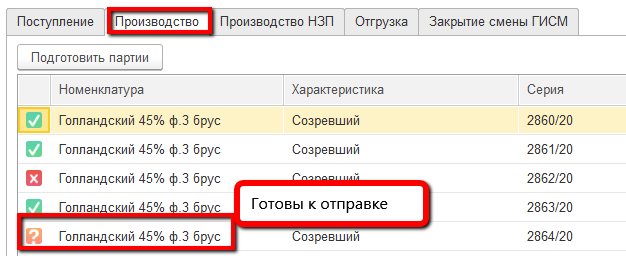

- Нажать "Подготовить партии" два раза с небольшой паузой. Создадутся документы их подготовки:

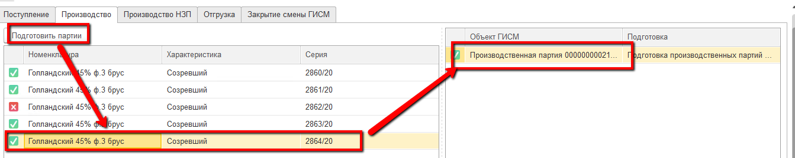

- Перейти на вкладку "Отгрузка" и установить отбор на нужные склады отгрузки:

- В таблице будут видны данные по отгрузочным документам, готовые к отправке:

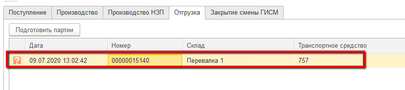

- Нажать "Подготовить партии" дважды с небольшой паузой. По каждому документу создадутся документы подготовки, оформятся ВСД:

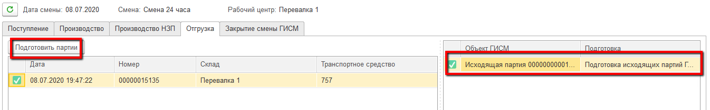