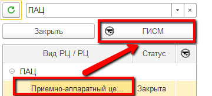

# Списание в незавершенное производство

Списание продукции в незавершенное производство происходит для тех позиций, для которых в [правилах интерпретаций](./SettingRulesForInterpretation.md) был установлен такой признак, происходит сразу же после того, как создаются производственные партии на их выпуск.

Поэтому, если в НЗП списывается принятое сырье, то после гашения ВСД создается документ списания его в НЗП. Если списывается продукция какого-либо этапа производства, то после в процессе закрытия смены, когда на продукцию создается сертификат, автоматически происходит её списание в НЗП.

Проследить, какие есть текущие транзакции НЗП, и получить о них некоторую информацию можно в Рабочем месте мастера смены.

- Открыть "Рабочее место мастера смены":

- Указать дату смены и смену.
- Указать участок, на котором продукция была списана в НЗП. Перейти в рабочее место мониторинга обмена по кнопке "ГИСМ":

- На вкладке "Производство НЗП" можно видеть транзакции по текущему РЦ. Если это месячная транзакция, то со временем напротив нее в правом столбце накапливаются списанные партии:

-  По транзакции также можно посмотреть, что на нее было списано, а что из нее было выпущено. Выбрать строку транзакции и нажать кнопку формирования отчета:

- Так, например, в данном отчете видно, что на транзакцию списано две партии молока, однако, с нее пока что не было выпусков:

- Когда появятся выпуски, то появится и раздел выпуска в этом же отчете (пример по другой транзакции):

